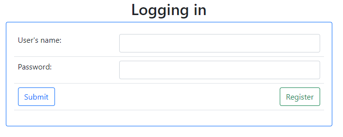
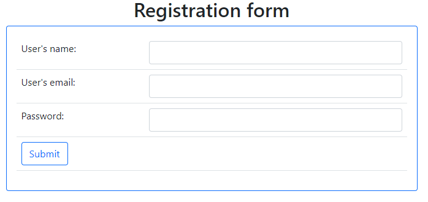
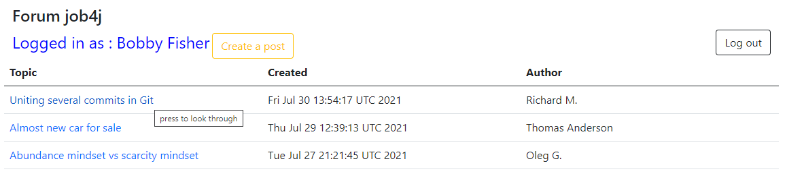
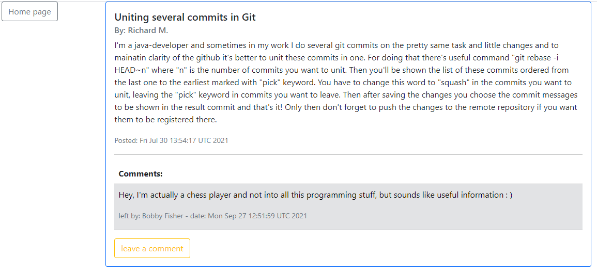
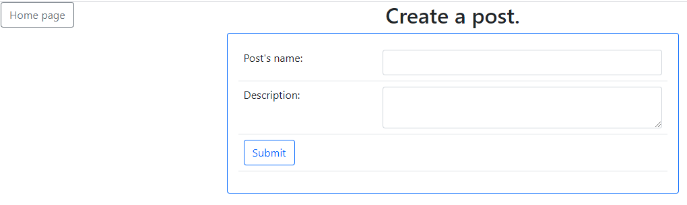

# Forum

This web-app represents a simple forum where users can post information and put comments under it.

#### Functionality:

    - Creating topics with description.
    - Viewing all the topics.
    - Leaving comments under any topic.
    
#### Technologies:

    - Spring Data providing the interaction with the database.
    - PostgreSQL as a database management system.
    - JSP pages with JSTL snippets providing the view.
    
#### Presentation:

As only logged in persons are permitted to use the app, first you are directed to the login page.

To create a new account click 'Register' button.

Once you have registered and submitted the credentials you pass to the forum page.
Here you can click any topic to view it, create a new post or log out.

Under a chosen topic you can leave a comment.

Click 'Create a post' for proceeding to the post creation page.
Here you type the post's name and content.

